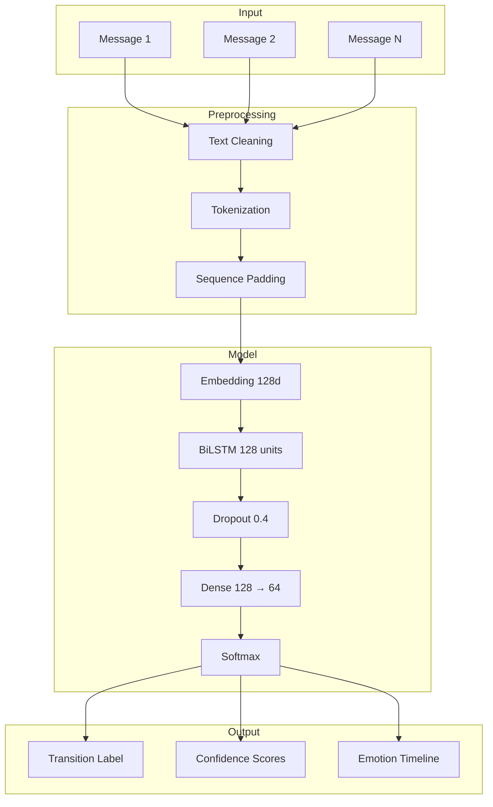

# Context-Aware Emotional Transition Detection using LSTM Networks

[]()
[]()
[]()

> **Final Year Project** — An industry-grade AI system that analyzes **emotional progression** across multi-turn conversations using **Bidirectional LSTM** sequence learning, rather than isolated sentence classification.

---

## Abstract

Emotion recognition in dialogue requires understanding how feelings **evolve over time**. This project implements a context-aware deep learning system that predicts **emotional transitions** (e.g., `neutral → anger`, `joy → sadness`) from conversational history. Using the **MELD** (Multimodal EmotionLines Dataset) corpus, utterance sequences are encoded via embedding layers and processed through **Bidirectional LSTM** networks with dropout regularization. A modern **Streamlit dashboard** provides real-time prediction, transition timelines, confidence analytics, and PDF export.

---

## Key Features

| Feature | Description |
|---------|-------------|
| Real-time prediction | Live text → transition + confidence |
| Conversation memory | LSTM-style sliding context window |
| Emotion timeline | Interactive Plotly visualization |
| Confidence bars | Top-k transition probabilities |
| Analytics dashboard | Distribution, heatmap, frequency stats |
| Confusion matrix | Evaluation on held-out dialogues |
| Training graphs | Accuracy & loss curves |
| FastAPI backend | REST endpoints for integration |
| PDF export | Analytics report download |
| RNN comparison | Optional vanilla RNN baseline |

---

## Project Structure

```
RNN/
├── app/                    # FastAPI REST API
│   └── api.py
├── models/                 # LSTM / RNN architectures
│   └── lstm_model.py
├── dataset/
│   ├── raw/                # MELD CSV files
│   └── processed/          # Transition samples
├── training/
│   ├── train.py            # Model training
│   └── evaluate.py         # Metrics & plots
├── utils/                  # Preprocessing, inference, viz
├── outputs/                # Graphs, metrics, HTML charts
├── saved_models/           # Trained model artifacts
├── report/                 # Full project report & PPT
├── notebooks/
├── screenshots/
├── streamlit_app.py        # Main dashboard UI
├── run_project.py          # One-click runner
└── requirements.txt
```

---

## System Architecture



---

## Dataset: MELD

We use the **[MELD](https://github.com/declare-lab/MELD)** dataset — a multiparty conversational emotion corpus derived from the TV series *Friends*. Each utterance is labeled with one of seven emotions:

`anger | disgust | fear | joy | neutral | sadness | surprise`

**Why MELD?** Unlike single-label tweet datasets (GoEmotions), MELD preserves **dialogue structure** with `Dialogue_ID` and `Utterance_ID`, enabling authentic transition modeling.

---

## Quick Start

### 1. Install dependencies

```bash
cd RNN
pip install -r requirements.txt
python -c "import nltk; nltk.download('stopwords'); nltk.download('wordnet'); nltk.download('punkt')"
```

### 2. Train the model

```bash
# Full training (~15 epochs)
python -m training.train

# Best accuracy training (recommended — ~25 epochs, class weights, tuned hyperparameters)
python -m training.train --best

# Quick demo training (~5 epochs)
python -m training.train --quick
```

### 3. Evaluate

```bash
python -m training.evaluate
```

### 4. Launch dashboard

```bash
streamlit run streamlit_app.py
```

### One-click (install + train + evaluate + app)

```bash
python run_project.py --all
```

### FastAPI (optional)

```bash
uvicorn app.api:app --reload --port 8000
```

---

## Model Architecture

| Layer | Parameters | Purpose |
|-------|-----------|---------|
| Embedding | 15000 × 128 | Word → dense vector |
| BiLSTM-1 | 128 units, return sequences | Contextual encoding |
| Dropout | 0.4 | Regularization |
| BiLSTM-2 | 64 units | Sequence aggregation |
| Dense | 128 → 64, ReLU | Feature learning |
| Softmax | num_classes | Transition probabilities |

---

## Why LSTM?

| RNN Limitation | LSTM Solution |
|----------------|---------------|
| Vanishing gradients on long dialogues | Gated cell state preserves long-range context |
| Weak memory of early utterances | Forget/input/output gates selectively retain emotion cues |
| Single-direction context | Bidirectional LSTM reads forward + backward |

**Hidden state** \( h_t \) at each timestep encodes "what emotion the conversation is heading toward" based on all prior utterances in the window.

---

## API Endpoints

| Method | Endpoint | Description |
|--------|----------|-------------|
| GET | `/health` | Model status |
| POST | `/predict` | Predict from raw context |
| POST | `/predict/message` | Predict with memory |
| POST | `/predict/conversation` | Full dialogue analysis |
| POST | `/reset` | Clear conversation memory |

---

## Screenshots

Place dashboard screenshots in `screenshots/` after running the app:
- `screenshots/home.png`
- `screenshots/live_prediction.png`
- `screenshots/timeline.png`

---

## Documentation

| Document | Path |
|----------|------|
| Full Report | `report/PROJECT_REPORT.md` |
| PPT Content | `report/PRESENTATION.md` |
| Viva Q&A | `report/VIVA_QUESTIONS.md` |
| Diagrams | `report/DIAGRAMS.md` |
| Abstract | `report/ABSTRACT.md` |

---

## Future Enhancements

- Multimodal fusion (audio + text from MELD)
- Transformer encoder (BERT) comparison
- Real-time voice pipeline (Whisper + LSTM)
- Cross-lingual emotion transitions

---

## References

1. Poria, S. et al. (2019). *MELD: A Multimodal Multi-Party Dataset for Emotion Recognition in Conversations.*
2. Hochreiter, S. & Schmidhuber, J. (1997). *Long Short-Term Memory.*
3. Chatterjee, A. et al. (2019). *Understanding Emotions in Text Using Deep Learning.*

---

## License

Academic / educational use for final year project demonstration.
