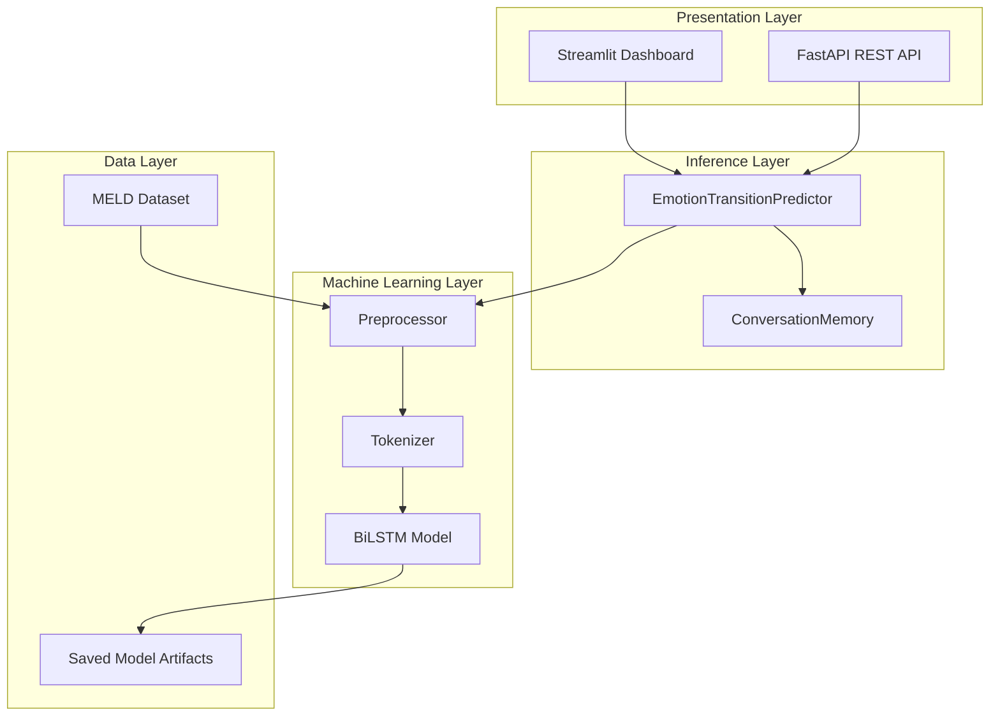
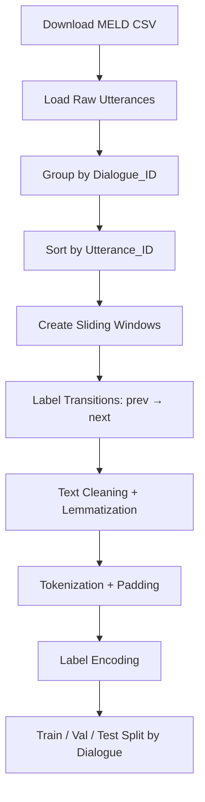
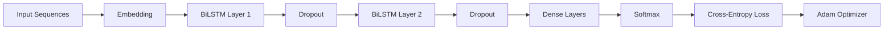
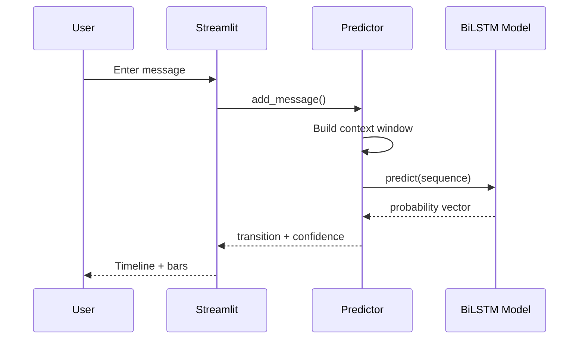
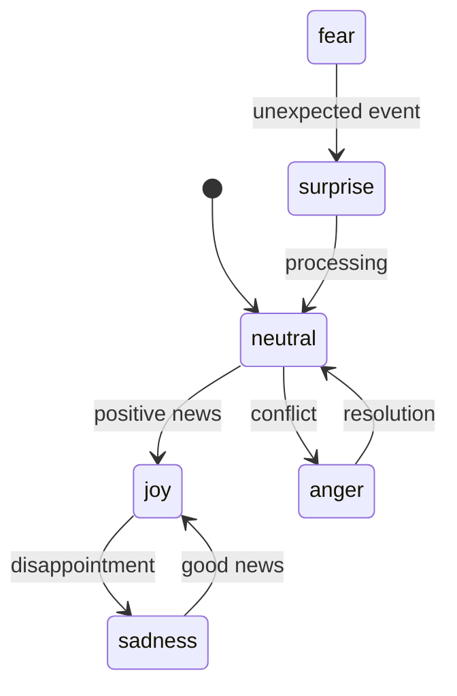

# Architecture Diagrams & Flowcharts

## 1. High-Level System Architecture



## 2. Data Processing Flowchart



## 3. LSTM Training Pipeline



## 4. Inference Flow



## 5. Emotion State Machine (Conceptual)



## 6. Hidden State Memory Concept

```
Timestep:    t=1        t=2         t=3         t=4
Input:       x_1        x_2         x_3         x_4
Hidden:      h_1  -->   h_2   -->   h_3   -->   h_4
             │          │           │           │
Context:   "hello"   "I'm upset"  "why?"    "stop it"
                                              ↓
Prediction:                          neutral → anger
```

The hidden state **h_t** accumulates emotional context from all prior utterances in the window, enabling transition detection that depends on conversational history.
