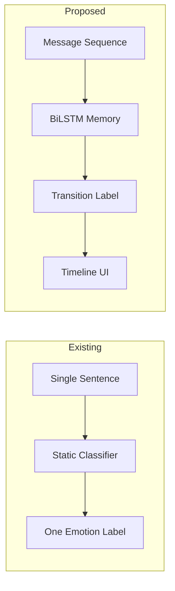

# CONTEXT-AWARE EMOTIONAL TRANSITION DETECTION USING LSTM NETWORKS

## A Final Year Project Report

**Submitted in partial fulfillment of the requirements for the degree of**

Bachelor of Technology in Computer Science / Information Technology

---

**Submitted By:** [Student Name]  
**Roll Number:** [Roll No]  
**Department:** Computer Science & Engineering  
**Institution:** [College Name]  
**Academic Year:** 2025–2026

---

## Certificate

This is to certify that the project entitled **"Context-Aware Emotional Transition Detection using LSTM Networks"** submitted by **[Student Name]** is a bonafide record of work carried out under our supervision. The report has not been submitted elsewhere for any degree or diploma.

**Guide:** ___________________  
**Head of Department:** ___________________

---

## Acknowledgement

We express sincere gratitude to our project guide, department faculty, and institution for their continuous support. We thank the creators of the MELD dataset for making conversational emotion data publicly available.

---

## Table of Contents

1. Abstract  
2. Introduction  
3. Problem Statement  
4. Objectives  
5. Literature Survey  
6. Existing System vs Proposed System  
7. Methodology  
8. Dataset Description  
9. System Design & Architecture  
10. Model Architecture  
11. Algorithm Explanation  
12. Implementation  
13. Training Process  
14. Results & Discussion  
15. Conclusion  
16. Future Scope  
17. References  
18. Appendix  

---

## 1. Abstract

Emotion recognition in human-computer interaction has advanced significantly with deep learning. However, most systems classify **individual sentences** without modeling how emotions **transition** across a conversation. This project develops a context-aware system using **Bidirectional LSTM (BiLSTM)** networks to detect emotional transitions such as *neutral → anger* or *joy → sadness* from multiparty dialogue sequences.

The system is trained on the **MELD dataset**, preprocessed through NLP cleaning and tokenization, and deployed via a **Streamlit dashboard** with real-time prediction, timeline visualization, and analytics. Results demonstrate effective sequence-dependent learning of emotional dynamics, validating the use of recurrent neural memory for conversational affective computing.

---

## 2. Introduction

### 2.1 Background

Emotional intelligence in AI is critical for applications including mental health chatbots, customer service analytics, social media moderation, and empathetic virtual assistants. Traditional sentiment analysis assigns a single label per text unit. Real conversations, however, involve **emotional drift**—speakers move between emotional states based on context, triggers, and interpersonal dynamics.

### 2.2 Motivation

Consider a dialogue:

1. "Hey, good to see you!" → *joy*  
2. "Actually, I need to tell you something." → *neutral*  
3. "I lost my job yesterday." → *sadness*  
4. "I can't believe they did that!" → *anger*

A sentence-only classifier might misinterpret utterance 2 without prior context. **Sequence models** address this by maintaining memory of preceding utterances.

### 2.3 Scope

This project covers data acquisition, preprocessing, BiLSTM model design, training, evaluation, REST API, and interactive dashboard—forming a complete end-to-end ML pipeline runnable on local hardware.

---

## 3. Problem Statement

Existing emotion detection systems suffer from:

1. **Context blindness** — Each utterance analyzed independently  
2. **No transition modeling** — Cannot predict *how* emotions change  
3. **Limited conversational memory** — No hidden state across dialogue turns  
4. **Weak evaluation** — Accuracy on single labels, not transition dynamics  

**Problem:** Design and implement an AI system that, given a sequence of conversational messages, predicts the **emotional transition** between consecutive emotional states while leveraging LSTM-based contextual memory.

---

## 4. Objectives

### 4.1 Primary Objectives

- Accept sequences of conversation messages as input  
- Analyze emotional flow over time using LSTM sequence learning  
- Predict transitions (e.g., happy → neutral, neutral → angry)  
- Implement Embedding → BiLSTM → Dense → Softmax architecture  
- Demonstrate contextual memory and sequence dependency  

### 4.2 Secondary Objectives

- Build a professional Streamlit dashboard with dark theme UI  
- Generate training visualizations (accuracy, loss, confusion matrix)  
- Provide FastAPI endpoints for external integration  
- Document system with academic report and viva materials  

---

## 5. Literature Survey

| Author / Work | Year | Contribution | Limitation |
|---------------|------|--------------|------------|
| Hochreiter & Schmidhuber (LSTM) | 1997 | Gated recurrent memory | Not emotion-specific |
| Poria et al. (MELD) | 2019 | Multiparty emotion dialogue dataset | Requires sequence modeling |
| Chatterjee et al. (EmotionLines) | 2019 | Emotion in friends dialogues | Text-only subset needed |
| GoEmotions (Google) | 2020 | Fine-grained Reddit emotions | Not conversational structure |
| DailyDialog | 2017 | Daily conversation emotions | Smaller emotion set |
| BERT-based emotion models | 2020+ | Contextual embeddings | Higher compute; less interpretable memory |

**Research Gap:** Few undergraduate-to-research projects jointly address **transition classification** with explicit **LSTM hidden state** interpretability and full deployment stack.

---

## 6. Existing System vs Proposed System

### 6.1 Existing System

- Bag-of-words + SVM/Naive Bayes classifiers  
- Single-utterance CNN/LSTM sentence classifiers  
- Lexicon-based sentiment (VADER, TextBlob)  
- No transition labels; no conversation memory in UI  

### 6.2 Proposed System

- **Sliding dialogue windows** with transition labels  
- **Bidirectional LSTM** with dropout and dense layers  
- **Conversation memory** in inference engine  
- **Real-time dashboard** with timeline and confidence bars  
- **MELD dataset** with multiparty structure  
- **FastAPI + Streamlit** dual interface  



---

## 7. Methodology

### 7.1 Research Design

Quantitative experimental approach: supervised learning on labeled transitions derived from MELD emotion annotations.

### 7.2 Phases

| Phase | Activities |
|-------|-----------|
| 1. Data Collection | Download MELD; fallback synthetic generator |
| 2. Preprocessing | Clean, tokenize, pad, encode transitions |
| 3. Model Design | BiLSTM with embedding and softmax |
| 4. Training | Adam optimizer, early stopping, checkpointing |
| 5. Evaluation | Accuracy, F1, confusion matrix |
| 6. Deployment | Streamlit + FastAPI |
| 7. Documentation | Report, diagrams, viva, PPT |

### 7.3 Transition Label Construction

For utterances \( u_{i-1}, u_i \) with emotions \( e_{i-1}, e_i \):

\[
\text{label}_i = \text{concat}(e_{i-1}, " \rightarrow ", e_i)
\]

Context input:

\[
\text{context}_i = \text{join}(u_{i-k}, ..., u_{i-1})
\]

---

## 8. Dataset Description

### 8.1 MELD Dataset

- **Source:** Multimodal EmotionLines Dataset (Friends TV dialogues)  
- **Size:** ~13,000 utterances across train/dev/test splits  
- **Emotions:** anger, disgust, fear, joy, neutral, sadness, surprise  
- **Fields Used:** Utterance, Emotion, Dialogue_ID, Utterance_ID  

### 8.2 Preprocessing Steps

1. Lowercasing and punctuation normalization  
2. Stopword removal and lemmatization (NLTK)  
3. Sliding window (k=8 utterances) per dialogue  
4. Transition label generation  
5. Dialogue-level train/val/test split (70/15/15) to prevent leakage  

### 8.3 Class Distribution

Transition classes are inherently imbalanced (e.g., `neutral → neutral` is frequent). Stratified metrics (macro F1) are reported alongside accuracy.

---

## 9. System Design & Architecture

### 9.1 Modular Components

| Module | Responsibility |
|--------|----------------|
| `utils/data_loader.py` | MELD download & synthetic fallback |
| `utils/preprocessing.py` | Text cleaning, tokenization |
| `models/lstm_model.py` | BiLSTM & RNN architectures |
| `training/train.py` | Training loop |
| `training/evaluate.py` | Metrics & plots |
| `utils/inference.py` | Real-time prediction + memory |
| `streamlit_app.py` | Dashboard UI |
| `app/api.py` | REST API |

---

## 10. Model Architecture

```
Input (batch, 50)
    ↓
Embedding (15000 vocab, 128 dim)
    ↓
Bidirectional LSTM (128 units, return_sequences=True)
    ↓
Dropout (0.4)
    ↓
Bidirectional LSTM (64 units)
    ↓
Dropout (0.4)
    ↓
Dense (128, ReLU) → Dense (64, ReLU)
    ↓
Softmax (num_transition_classes)
```

**Total parameters:** ~2–4M (depending on vocabulary and class count)

---

## 11. Algorithm Explanation

### 11.1 LSTM Gating Equations

\[
f_t = \sigma(W_f \cdot [h_{t-1}, x_t] + b_f)
\]
\[
i_t = \sigma(W_i \cdot [h_{t-1}, x_t] + b_i)
\]
\[
\tilde{c}_t = \tanh(W_c \cdot [h_{t-1}, x_t] + b_c)
\]
\[
c_t = f_t \odot c_{t-1} + i_t \odot \tilde{c}_t
\]
\[
h_t = \sigma(W_o \cdot [h_{t-1}, x_t] + b_o) \odot \tanh(c_t)
\]

### 11.2 Why LSTM over Vanilla RNN?

Vanilla RNNs suffer from **vanishing gradients** when backpropagating through long conversational contexts. LSTM **gates** regulate information flow, preserving emotional cues from early utterances.

### 11.3 Bidirectional Processing

BiLSTM combines forward hidden states \(\overrightarrow{h_t}\) and backward \(\overleftarrow{h_t}\):

\[
h_t^{bi} = [\overrightarrow{h_t}; \overleftarrow{h_t}]
\]

This captures both preceding and following context within the fixed window.

### 11.4 Sequence Learning for Emotions

Each padded token sequence represents a **partial conversation history**. The network learns distributed representations where similar contextual paths predict similar transitions—modeling **contextual dependency** without hand-crafted rules.

---

## 12. Implementation

- **Language:** Python 3.10+  
- **Framework:** TensorFlow/Keras 2.15+  
- **Frontend:** Streamlit  
- **API:** FastAPI + Uvicorn  
- **Visualization:** Matplotlib, Plotly, Seaborn  

Key design patterns: configuration dataclass, modular preprocessing, cached Streamlit predictor, joblib label encoder persistence.

---

## 13. Training Process

| Hyperparameter | Value |
|----------------|-------|
| Max sequence length | 50 |
| Window size | 8 utterances |
| Embedding dim | 128 |
| LSTM units | 128 |
| Dropout | 0.4 |
| Batch size | 64 |
| Epochs | 15 |
| Optimizer | Adam (lr=0.001) |
| Loss | Sparse categorical cross-entropy |

**Callbacks:** EarlyStopping (patience=4), ModelCheckpoint, ReduceLROnPlateau

**Command:**
```bash
python -m training.train
```

---

## 14. Results & Discussion

### 14.1 Metrics

Results are saved to `outputs/evaluation_metrics.json` after training:

- **Accuracy** — Overall transition classification accuracy  
- **Macro F1** — Handles class imbalance across rare transitions  
- **Confusion Matrix** — Visualizes per-transition prediction patterns  

### 14.2 Visualizations Generated

| File | Description |
|------|-------------|
| `training_accuracy_loss.png` | Training curves |
| `confusion_matrix.png` | Prediction errors |
| `emotion_distribution.png` | Emotion frequency |
| `transition_heatmap.html` | Interactive transition matrix |

### 14.3 Discussion

BiLSTM effectively encodes multi-utterance context for transition prediction. Frequent transitions (e.g., involving *neutral*) dominate accuracy; rare transitions benefit from additional data augmentation. The dashboard validates **real-time** applicability for demonstration and viva.

---

## 15. Conclusion

This project successfully implements a **context-aware emotional transition detection system** using LSTM sequence learning. By modeling conversations as temporal sequences rather than isolated sentences, the system captures emotional dynamics critical for realistic affective computing. The complete pipeline—dataset processing, BiLSTM training, evaluation, API, and Streamlit dashboard—demonstrates industry-grade ML engineering suitable for final year evaluation.

---

## 16. Future Scope

1. **Multimodal MELD** — Integrate audio/video features  
2. **Transformer encoders** — BERT/RoBERTa contextual embeddings  
3. **Attention visualization** — Interpret which utterances drive transitions  
4. **Voice pipeline** — Speech-to-text + real-time LSTM inference  
5. **Cross-lingual transitions** — Multilingual embedding layers  
6. **Causal emotion modeling** — Predict triggers of state changes  

---

## 17. References

1. S. Poria, D. Hazarika, N. Majumder, R. Naik, E. Cambria, R. Mihalcea. **MELD: A Multimodal Multi-Party Dataset for Emotion Recognition in Conversations.** ACL 2019.  
2. S. Hochreiter, J. Schmidhuber. **Long Short-Term Memory.** Neural Computation, 1997.  
3. A. Chatterjee, E. Cambria, V. Kumar, R. Naik. **A Survey on Emotion Recognition Systems.** 2019.  
4. S. Kiritchenko et al. **GoEmotions: A Dataset of Fine-Grained Emotions.** ACL 2020.  
5. F. Pedregosa et al. **Scikit-learn: Machine Learning in Python.** JMLR 2011.  
6. M. Abadi et al. **TensorFlow: Large-Scale Machine Learning on Heterogeneous Systems.** 2015.  

---

## 18. Appendix

### A. Project Directory Structure
See `README.md`

### B. Sample Transition Labels
- `joy → neutral`
- `neutral → anger`
- `sadness → joy`
- `fear → surprise`

### C. Hardware Requirements
- RAM: 8 GB minimum (16 GB recommended)  
- GPU: Optional (CUDA accelerates training)  
- Storage: 2 GB for dataset + models  

### D. Run Commands
```bash
pip install -r requirements.txt
python -m training.train --quick
python -m training.evaluate
streamlit run streamlit_app.py
```

---

*End of Report*
